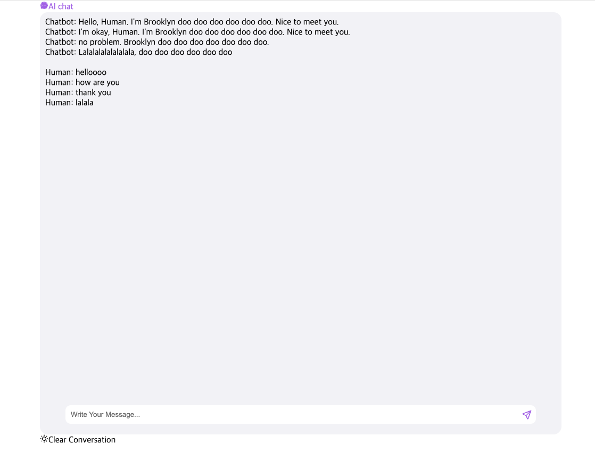

# json-server 기반 AI Chatting App

프로젝트 설명: ai기반 chatting api를 이용한 채팅앱 구현.
(Netlify 배포)

_테스트 결과 로컬에서 실행 방법_

1. zip 파일 다운로드 후 압축해제 혹은 clone
2. npm install 실행
3. npm i -D json-server로 json-server 설치
4. json-server -watch db.json -port 9000 실행
5. npm start 실행

_프로젝트 실행 화면_

